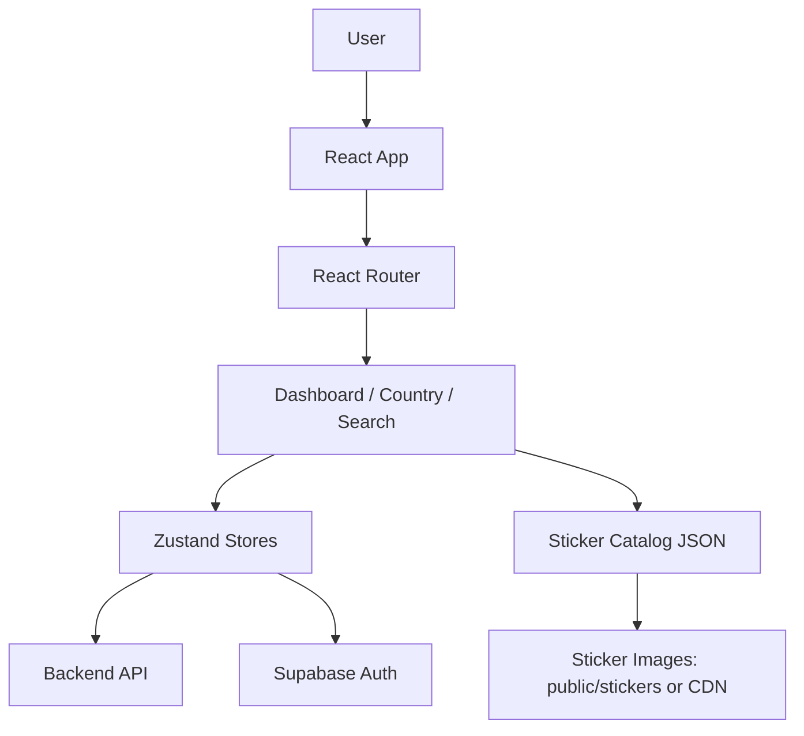

<div align="center">

# Mundial Pop Album Frontend

A Vite + React frontend for a digital World Cup sticker album with Supabase Auth, backend-synced progress, search, filters, and missing-sticker export.

</div>

<p align="center">
  
  
  
  
</p>

<div align="center">

**Nicolas AI Engineering Lab**<br>
AI Engineering - Software Architecture - Cloud - Agent Systems

</div>

## Overview

This repository contains the frontend for a sticker album experience. Users can sign in, create or load their album, track owned stickers, filter by country, search exact sticker codes, and export missing stickers grouped by country.

<table>
<tr>
<td width="50%">

### Album Tracking

Country dashboards, per-team progress, owned/missing filters, repeated-count support, and optimistic UI updates.

</td>
<td width="50%">

### Deployment Ready

Configured for Vercel with SPA rewrites, environment-based API URLs, and external sticker asset hosting support.

</td>
</tr>
<tr>
<td width="50%">

### Auth + Backend Sync

Supabase Auth provides browser sessions. Backend requests include the Supabase access token when available.

</td>
<td width="50%">

### Sticker Assets

Large sticker images are intentionally kept out of Git. Production should use `VITE_STICKER_ASSET_BASE_URL` backed by CDN/storage.

</td>
</tr>
</table>

## Architecture



| Layer | Responsibility |
|---|---|
| `src/app` | Router and app bootstrapping. |
| `src/pages` | Route-level screens. |
| `src/components` | Album, sticker, layout, search, and export UI. |
| `src/stores` | Zustand state for auth and album progress. |
| `src/services` | Backend API client and Supabase client. |
| `src/data` | Sticker catalog, country metadata, and themes. |

## Quick Start

```bash
npm install
cp .env.example .env
npm run dev
```

Open `http://localhost:5173`.

## Environment Variables

| Variable | Required | Purpose |
|---|---:|---|
| `VITE_API_URL` | Yes | Browser-facing backend API base URL. Use `/api` locally with Vite proxy or a public API URL in production. |
| `VITE_API_PROXY_TARGET` | Local only | Optional Vite dev proxy target for `/api`. Do not use for a static Vercel production build. |
| `VITE_SUPABASE_URL` | Yes for login | Public Supabase project URL. |
| `VITE_SUPABASE_ANON_KEY` | Yes for login | Public Supabase anon key. |
| `VITE_STICKER_ASSET_BASE_URL` | Production recommended | Public base URL for sticker images, for example `https://cdn.example.com/album-assets`. |

## Vercel Deployment

This app includes `vercel.json` with:

- `npm ci` as install command.
- `npm run build` as build command.
- `dist` as output directory.
- SPA fallback rewrites to `index.html`.

Before deploying, set these Vercel environment variables:

```env
VITE_API_URL=https://your-backend-domain.com/api
VITE_SUPABASE_URL=https://your-project.supabase.co
VITE_SUPABASE_ANON_KEY=your-public-anon-key
VITE_STICKER_ASSET_BASE_URL=https://your-cdn-or-storage-domain
```

See [`docs/DEPLOYMENT.md`](./docs/DEPLOYMENT.md) for the full deployment checklist.

## Scripts

| Command | Purpose |
|---|---|
| `npm run dev` | Start local Vite dev server. |
| `npm run build` | Typecheck and build production output. |
| `npm run preview` | Preview the production build locally. |
| `npm run typecheck` | Run TypeScript validation. |
| `npm run test` | Run Vitest test suite. |
| `npm run dev:docker` | Run Vite bound to `0.0.0.0:5173`. |

## Project Structure

```txt
Album-frontend/
|-- docs/
|   `-- DEPLOYMENT.md
|-- public/
|   `-- stickers/              # Local-only sticker assets, ignored by Git
|-- src/
|   |-- app/
|   |-- components/
|   |-- config/
|   |-- data/
|   |-- pages/
|   |-- services/
|   |-- stores/
|   |-- styles/
|   `-- test/
|-- album_stickers_final.json
|-- vercel.json
|-- vite.config.ts
`-- package.json
```

## Before vs After

| Before | After |
|---|---|
| Vercel SPA routing was implicit | `vercel.json` now defines static output and route fallback |
| Large duplicate local sticker folders could be committed accidentally | Git/Vercel ignore rules keep local assets and generated folders out |
| Production sticker hosting was coupled to `public/stickers` | `VITE_STICKER_ASSET_BASE_URL` supports external asset hosting |
| README only covered local basics | README now documents architecture, environment, scripts, and deployment |

## Visual Assets Needed

| Asset | Suggested Path | Purpose |
|---|---|---|
| Banner | `assets/banner.png` | GitHub hero identity for the project. |
| Demo Screenshot | `assets/screenshots/dashboard.png` | Show the album dashboard in the README. |
| Country Screenshot | `assets/screenshots/country-page.png` | Show the sticker grid and filters. |

Banner prompt:

```txt
Dark modern engineering banner for "Mundial Pop Album Frontend" by Nicolas AI Engineering Lab. Use GitHub dark background #0D1117, blue accent #58A6FF, purple accent #8B5CF6, subtle sticker album grid, football-inspired details, clean SaaS documentation style, no clutter, no cartoon style.
```

## Author

Built by **Nicolas Hoyos**<br>
Software Engineering - AI Engineering - Software Architecture

> Building intelligent systems, scalable architectures, and practical AI products.
