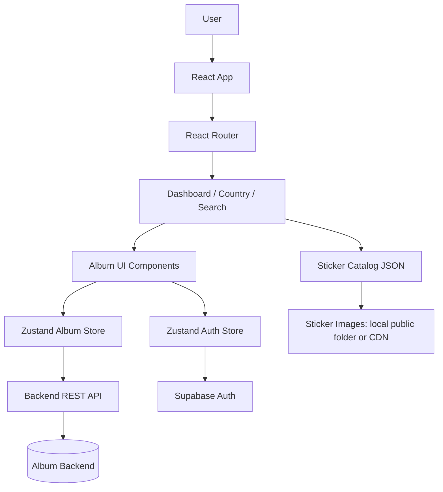

<p align="center">
  
</p>

<div align="center">

# Mundial Pop Album Frontend

A deployable Vite + React frontend for a digital World Cup sticker album: collect stickers, track progress, search exact codes, and export missing stickers.

</div>

<p align="center">
  
  
  
  
  
</p>

<div align="center">

**Nicolas AI Engineering Lab**<br>
AI Engineering - Software Architecture - Cloud - Agent Systems

</div>

## Overview

Mundial Pop Album Frontend is the browser application for a digital football sticker album. It combines a static sticker catalog, country-themed album pages, Supabase authentication, and a backend API for persistent album progress.

<table>
<tr>
<td width="50%">

### Collect and Track

Users can create or load an album, mark stickers as owned, increment repeated stickers, and see overall or per-country progress.

</td>
<td width="50%">

### Search and Export

Exact-code search helps locate stickers quickly, while the export flow generates a missing-sticker list grouped by country.

</td>
</tr>
<tr>
<td width="50%">

### Backend Synced

Zustand manages UI state and syncs album changes through a REST API using the Supabase access token.

</td>
<td width="50%">

### Vercel Ready

The repo includes SPA rewrites, build configuration, deployment docs, and CDN-ready sticker asset configuration.

</td>
</tr>
</table>

## Product Preview

<p align="center">
  
</p>

## Problem

A sticker album is visual, collectible, and progress-driven. A plain checklist would technically work, but it would miss the core product feeling: browsing countries, seeing empty slots, sticking collected images, and sharing what is still missing.

## Solution

This frontend treats the album as a product experience rather than a data table:

- Country cards show progress and visual identity.
- Country pages behave like album sheets with owned/missing filters.
- Sticker slots support image previews, quantity badges, and optimistic updates.
- Search accepts practical user input formats such as `BRA 05`, `bra05`, or `FRA007`.
- Deployment separates the app bundle from large sticker image assets.

## Architecture



| Layer | Responsibility |
|---|---|
| `src/app` | Application bootstrapping and route definitions. |
| `src/pages` | Route-level screens for dashboard, country album, and search. |
| `src/components` | Reusable album, sticker, layout, search, setup, and export UI. |
| `src/stores` | Zustand auth and album state, including optimistic sync behavior. |
| `src/services` | Backend API client and Supabase browser client. |
| `src/data` | Sticker catalog, derived country metadata, and visual themes. |
| `docs/assets` | README visual assets used for portfolio presentation. |

## Tech Stack

<p align="center">
  
</p>

| Area | Tools |
|---|---|
| Frontend | React 18, React Router |
| Language | TypeScript |
| Styling | Tailwind CSS |
| State | Zustand |
| Auth | Supabase Auth |
| Build | Vite |
| Testing | Vitest, Testing Library |
| Deployment | Vercel static deployment, Docker for local/dev workflows |

## Quick Start

```bash
npm install
cp .env.example .env
npm run dev
```

Open `http://localhost:5173`.

## Environment Variables

| Variable | Required | Purpose |
|---|---:|---|
| `VITE_API_URL` | Yes | Browser-facing backend API base URL. Use `/api` locally with Vite proxy or a public API URL in production. |
| `VITE_API_PROXY_TARGET` | Local only | Optional Vite dev proxy target for `/api`. Do not use for a static Vercel production build. |
| `VITE_SUPABASE_URL` | Yes for login | Public Supabase project URL. |
| `VITE_SUPABASE_ANON_KEY` | Yes for login | Public Supabase anon key. |
| `VITE_STICKER_ASSET_BASE_URL` | Production recommended | Public base URL for sticker images, for example `https://cdn.example.com/album-assets`. |

## Vercel Deployment

This app includes `vercel.json` with:

- `npm ci` as install command.
- `npm run build` as build command.
- `dist` as output directory.
- SPA fallback rewrites to `index.html`.

Before deploying, set these Vercel environment variables:

```env
VITE_API_URL=https://your-backend-domain.com/api
VITE_SUPABASE_URL=https://your-project.supabase.co
VITE_SUPABASE_ANON_KEY=your-public-anon-key
VITE_STICKER_ASSET_BASE_URL=https://your-cdn-or-storage-domain
```

See [`docs/DEPLOYMENT.md`](./docs/DEPLOYMENT.md) for the full deployment checklist.

## Scripts

| Command | Purpose |
|---|---|
| `npm run dev` | Start local Vite dev server. |
| `npm run build` | Typecheck and build production output. |
| `npm run preview` | Preview the production build locally. |
| `npm run typecheck` | Run TypeScript validation. |
| `npm run test` | Run Vitest test suite. |
| `npm run dev:docker` | Run Vite bound to `0.0.0.0:5173`. |

## Project Structure

```txt
Album-frontend/
|-- docs/
|   |-- assets/
|   |   |-- album-footer.png
|   |   `-- album-front.png
|   `-- DEPLOYMENT.md
|-- public/
|   `-- stickers/              # Local-only sticker assets, ignored by Git
|-- src/
|   |-- app/
|   |-- components/
|   |-- config/
|   |-- data/
|   |-- pages/
|   |-- services/
|   |-- stores/
|   |-- styles/
|   `-- test/
|-- album_stickers_final.json
|-- vercel.json
|-- vite.config.ts
`-- package.json
```

## Before vs After

| Before | After |
|---|---|
| README explained the app but had no real visual identity | README now uses actual project artwork from `docs/assets` |
| Deployment information was present but visually flat | Deployment now sits inside a product-style technical landing page |
| Architecture was textual only | Architecture is supported by a renderable Mermaid flow |
| Large sticker assets could blur deployment strategy | README clearly separates source code from CDN/storage sticker assets |

## Roadmap

| Stage | Status | Focus |
|---|---|---|
| Frontend foundation | Done | Vite, React, routing, catalog, Tailwind, Zustand |
| Backend integration | Done | Supabase session and REST API sync |
| Deployment preparation | Done | Vercel config, environment docs, external asset base URL |
| Test coverage | Planned | Add real component/store tests beyond current setup |
| Production assets | Planned | Upload sticker image set to CDN/storage and configure `VITE_STICKER_ASSET_BASE_URL` |

## Engineering Notes

- Sticker image assets are intentionally not committed because the local set is large.
- Production should serve sticker images from CDN/storage using the same `/stickers/CODE/CODE_NN.png` path structure.
- Deep links such as `/country/ARG` work on Vercel through the configured SPA rewrite.
- The current test command supports an empty test suite, but real tests should be added before treating coverage as mature.

## Author

Built by **Nicolas Hoyos**<br>
Software Engineering - AI Engineering - Software Architecture

> Building intelligent systems, scalable architectures, and practical AI products.
